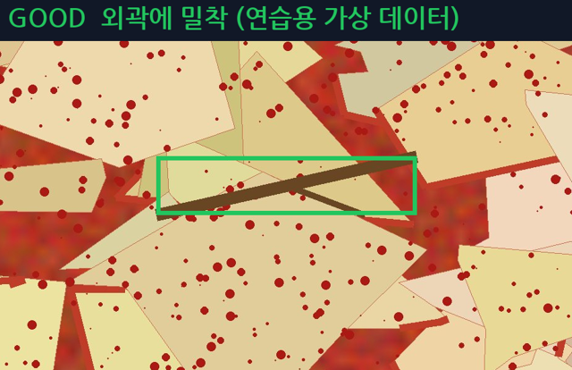
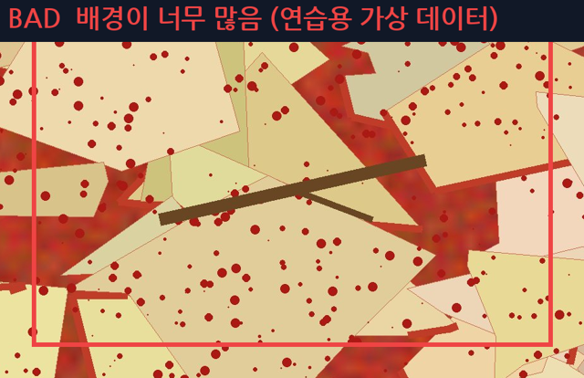

# Bounding Box Labeling Guide

## 공통 원칙

- BBox 는 객체의 실제 외곽에 최대한 밀착하여 작성합니다.
- 객체와 관계없는 배경을 지나치게 많이 포함하지 않습니다.
- 객체 일부가 가려져 있어도 보이는 범위를 기준으로 판단합니다.
- 하나의 BBox 에는 하나의 객체만 포함합니다.
- 판단이 어려우면 임의로 처리하지 않고 REVIEW 로 보냅니다.
- 작업할 때는 반드시 확대(휠, `+`)해서 외곽을 확인합니다. Fit 화면만 보고 그리지 않습니다.

---

## 1. 기본 BBox 작성 기준

객체의 외곽에 최대한 밀착하여 BBox 를 작성합니다. 테두리와 객체 사이 여백은 몇 픽셀 이내로 둡니다.

```text
GOOD                 BAD
┌───────┐            ┌────────────────┐
│ 객체  │            │                │
└───────┘            │     객체       │
                     │                │
                     └────────────────┘
```

BAD 는 객체 주변의 불필요한 배경이 너무 많이 포함된 경우입니다.
기존 BBox 가 이렇게 크면 `V`(선택 이동) 모드에서 흰 핸들을 끌어 줄이거나, 오른쪽 BBox 정보 칸에 좌표를 입력해 고칩니다.

## 2. 객체가 이미지 경계에 걸린 경우

화면에 실제로 보이는 부분까지만 BBox 를 작성합니다.
프로그램은 이미지 밖으로 나간 부분을 자동으로 잘라 저장합니다.

## 3. 객체가 서로 겹친 경우

각각을 구분할 수 있다면 객체마다 BBox 를 따로 작성합니다.

```text
나뭇가지 + 플라스틱 조각 → BBox 2개 (Class 2, Class 1)
```

## 4. 객체가 매우 작은 경우

작더라도 Class 를 식별할 수 있고 검출 대상이면 BBox 를 작성합니다.
점이나 얼룩처럼 객체인지 판단하기 어려우면 REVIEW (`too_small_to_identify`) 로 보냅니다.
가로·세로 3픽셀 미만의 BBox 는 실수 드래그로 보고 프로그램이 만들지 않습니다.

## 5. 객체 일부가 가려진 경우

Class 를 식별할 수 있다면 보이는 범위를 기준으로 BBox 를 작성합니다.
식별하기 어렵다면 REVIEW (`occlusion_ambiguous`) 로 보냅니다.

## 6. 하나의 객체를 여러 BBox 로 나누지 않습니다

하나의 긴 나뭇가지 → BBox 1개.
잘린 것처럼 보인다고 2개로 나누지 않습니다. 실제로 떨어진 별개의 객체라면 각각 작성합니다.
같은 객체에 BBox 가 두 개 겹쳐 있으면 Validation 이 `DUPLICATE` 로 알려 줍니다. 하나를 지웁니다.

## 7. 판단이 어려운 경우

BBox 범위나 객체 구분이 애매하면 임의로 결정하지 않습니다.

```text
상태 = REVIEW
Issue 칸 사유 예:
- bbox_boundary_ambiguous
- object_separation_ambiguous
- too_small_to_identify
- occlusion_ambiguous
```

## 8. 한 장 검수 순서

1. 전체 화면(`F`)으로 장면 확인 → Scene Type 선택
2. 왼쪽 위 → 오른쪽 위 → 왼쪽 아래 → 오른쪽 아래 → 중심 순서로 확대
3. 기존 BBox 가 물체를 가리면 `H` 로 잠시 숨기고 확인
4. 빠진 이물 추가, 틀린 Class 변경, 어긋난 BBox 조정, 잘못된 BBox 삭제
5. 수정했으면 Note 에 이유 기록 → `Space` (저장 후 다음)

## 팀 예시 이미지

예시 이미지는 `docs/images/` 에 넣고 아래에 연결합니다.
**NDA 때문에 실제 데이터 화면은 넣지 않고, 연습용 `data/dummy_raw` 화면만 사용합니다.**

| GOOD | BAD |
|---|---|
|  |  |
